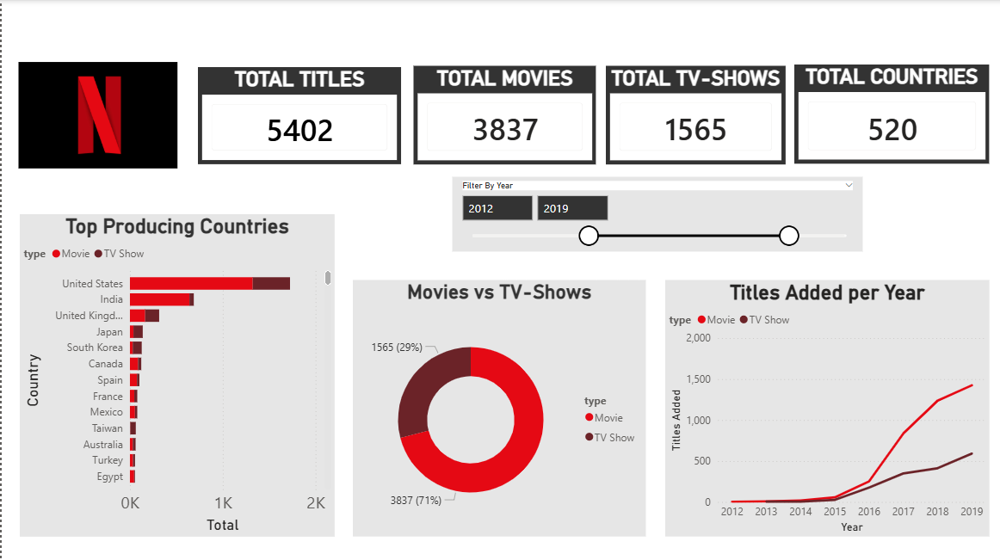
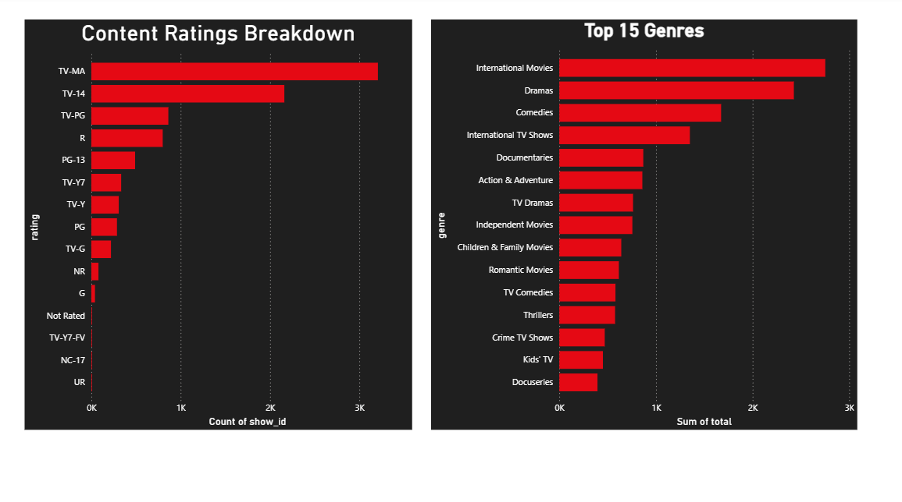
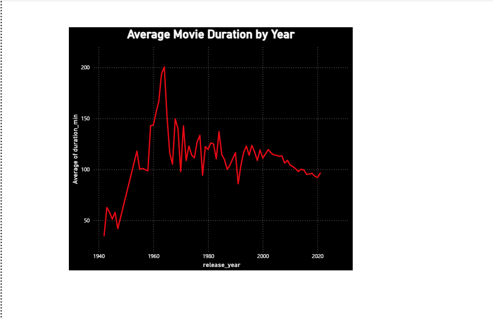

# Netflix Content Analysis 🎬

## Project Overview
An end-to-end data analysis project exploring Netflix's content 
catalog using Excel, MySQL, and Power BI. The goal was to uncover 
trends in content type, genre, ratings, country production, and 
movie duration to derive meaningful business insights.

---

## Tools Used
| Tool | Purpose |
|------|---------|
| Google Sheets/Excel | Data cleaning and preparation |
| MySQL | Data storage, querying and views |
| Power BI | Data visualization and dashboard |

---

## Dataset
- **Source:** Kaggle — Netflix Movies and TV Shows
- **Records:** 8,807 titles
- **Columns:** show_id, type, title, director, cast, country, 
               date_added, release_year, rating, duration, 
               listed_in, description

---

## Data Cleaning Process

### Google Sheets / Excel
- Replaced missing director values with "Unknown"
- Replaced missing country values with "Not Specified"
- Fixed misplaced rows where data had shifted into wrong columns
- Standardized date format from M/D/YYYY to YYYY-MM-DD 
  for easier extraction in MySQL

### MySQL
- Fixed misaligned rating and duration data for specific titles 
  (show_id: s5542, s5795, s5814)
- Standardized NULL and empty ratings to "Not Rated"
- Added duration_min column with numeric movie duration 
  extracted from the duration text column
- Created analytical views for each area of analysis

---

## SQL Views Created
| View | Purpose |
|------|---------|
| content_type | Movies vs TV Shows split by year |
| top_countries | Top producing countries by type |
| yearly_titles_added | Content growth trend by year |
| common_ratings | Ratings distribution |
| average_movie_duration | Avg movie length by release year |
| top_genres | Genre distribution (split from listed_in) |

---

## Key Insights

1. Netflix's catalog contains significantly more movies than TV 
   Shows, suggesting Netflix has historically prioritized movie 
   content acquisition.

2. Between 2012 and 2019, 3837 movies and 1565 TV Shows were 
   added to Netflix's catalog, with movies making up 71% of 
   total content.

3. 2019 was the peak year for content additions with both movies 
   and TV Shows reaching their highest point, reflecting Netflix's 
   aggressive content expansion strategy during that period.

4. Content additions grew slowly between 2012 and 2015 then 
   accelerated sharply from 2015 onwards, suggesting Netflix 
   significantly increased its content investment from 2015.

5. The United States is the largest content producing country on 
   Netflix by a significant margin, followed by India and the 
   United Kingdom, reflecting the dominance of Hollywood and 
   Bollywood in global entertainment.

6. TV-MA is the most common rating with over 3000 titles, 
   indicating Netflix primarily targets adult audiences, followed 
   by TV-14 for teen content, while children's content has 
   significantly fewer titles.

7. International Movies is the leading genre with nearly 3000 
   titles, showing Netflix's deliberate strategy to acquire global 
   content and attract international subscribers.

8. Average movie duration peaked around 1960 at nearly 200 minutes 
   then steadily declined to around 90 minutes by 2020, reflecting 
   a global industry shift toward shorter, more digestible content.

---

## Business Recommendations

1. Continue investing in International content to drive global 
   subscriber growth.
2. Increase TV Show production to improve viewer engagement 
   and subscription retention.
3. Expand content in emerging markets like India and South Korea 
   where production is already growing.
4. Maintain adult-targeted content as the core catalog while 
   balancing family-friendly options.

---

## Dashboard Preview

---

## Project Structure
netflix-analysis/
├── data/
|   ├── netflix_titles_cleaned.csv
│   └── netflix_titles_raw.csv
├── sql/
│   ├── data_cleaning.sql
│   └── analysis_views.sql
├── dashboard/
│   └── Netflix_Visualization.pbix
├── visuals/
│   └── dashboard screenshots
└── README.md

---

## Author
Prudence Chebet
[LinkedIn](https://linkedin.com/in/prudence-chebet) | prudence.chebet.k@gmail.com
[GitHub](https://github.com/chebetprudence)
